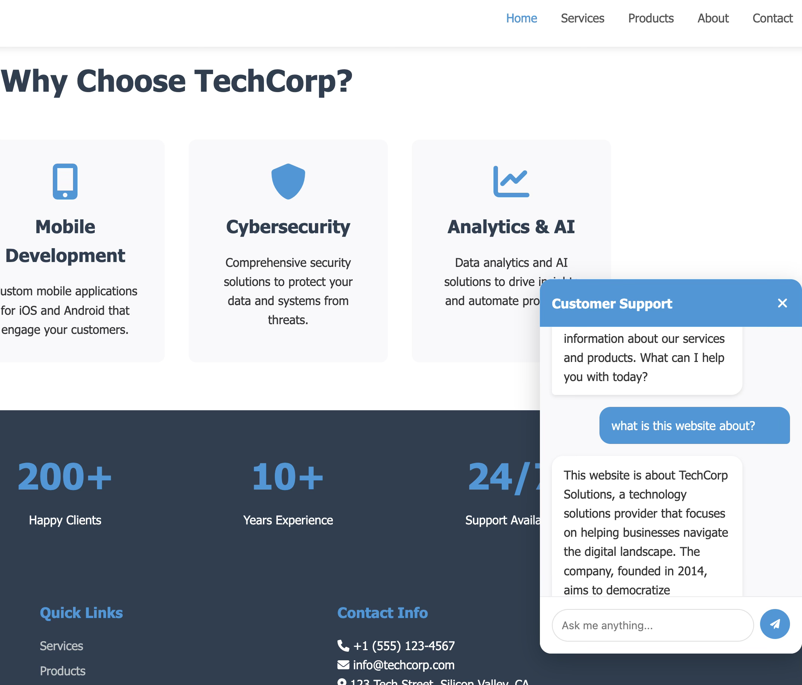

# Chatbot Assistant Template

A comprehensive project template for building AI-powered chatbot assistants with multiple LLM integrations, a modern web interface, and a plug-and-play chatbot widget powered by Retrieval-Augmented Generation (RAG) **using `llama_index` for context retrieval.**

## 🚀 Project Overview

This project serves as a practical playground and implementation template for integrating Large Language Models (LLMs) into web applications. It consists of four main components:

1. **LLM Playground** (`practices.ipynb`) - A Jupyter notebook for experimenting with different LLM APIs
2. **Backend Server** - FastAPI-based chatbot server with LLM and RAG integration (leveraging `llama_index` for retrieval)
3. **Frontend Template** - AI-generated modern web interface for testing the chatbot
4. **Customizable Chatbot Widget** - Embeddable real-time AI chat powered by RAG

## 🖼️ Chatbot Widget Overview

<p align="center">
  
</p>

**Above:** Example of the chatbot widget interface embedded into a static web page. The chatbot leverages Retrieval-Augmented Generation (RAG), which means it intelligently searches for relevant information from your content (such as documentation or company data) and uses it to provide accurate, context-aware answers to user questions.  
**In this project, we use [`llama_index`](https://github.com/jerryjliu/llama_index) for the underlying document indexing, semantic search, and context retrieval powering RAG.**

### How the Chatbot Works (RAG Powered with llama_index)

- When a user sends a question via the widget, the message is sent to the backend server.
- The server retrieves the most relevant context passages from your document collection using an embedding-based similarity search powered by `llama_index`.
- The context, along with the question, is sent to the LLM (e.g., GPT-4 via OpenAI, or OSS LLMs via Hugging Face).
- The LLM generates an answer, strictly conditioned on the provided context. If the answer cannot be confidently given from the context, it will say "I don't know".
- The response is sent back in real time and shown in the chat widget.

This enables your chatbot to give safe, reliable, and on-topic answers from your own business or project knowledge!

## 📁 Project Structure

```
chatbot_assistant_template/
├── practices.ipynb          # LLM experimentation playground
├── backend/
│   └── server.py           # FastAPI chatbot server (RAG logic with llama_index inside)
├── frontend/
│   ├── static_pages/       # HTML pages (AI-generated, includes chat widget)
│   ├── scripts/           # JavaScript for chat functionality and widget
│   └── styles/            # CSS styling
├── requirements.txt        # Python dependencies
├── setup.sh              # Setup script
└── README.md             # This file
```

## 🧪 LLM Playground (`practices.ipynb`)

The Jupyter notebook serves as a comprehensive learning environment for working with different LLM APIs and frameworks:

### Features:
- **Hugging Face Integration**: Direct model usage with transformers library
- **OpenAI API**: Text generation, image understanding, and conversational AI
- **Langchain Framework**: Chain-based LLM applications and sequential processing
- **Practical Examples**: Text generation, sentiment analysis, translation, and more

### Supported APIs:
- 🤗 Hugging Face Transformers
- 🧠 OpenAI GPT models
- 🔗 Langchain framework
- 🎯 Custom pipeline implementations

## 🤖 Backend Server

A FastAPI-based server designed to handle chatbot interactions, with full end-to-end Retrieval-Augmented Generation (RAG) **powered by `llama_index`**:

### Current Features:
- CORS-enabled API endpoints
- Chat message processing endpoint (`/chat`)
- Environment variable management
- Vector document retrieval (semantic search over your docs, using `llama_index`)
- LLM integration and prompt construction
- Error handling and logging

### Planned Implementation:
- Additional model options (OpenAI, Hugging Face, or custom models)
- Conversation memory and context management
- Response streaming capabilities
- Authentication and rate limiting

## 💬 Chatbot Widget Implementation

The frontend comes with a reusable chat widget that you can embed in any page of your business website or internal tool.

### Key Widget Features:
- Instant live chat interface with smooth UX
- User question input with support for multi-turn dialogue
- Shows streaming/loading status while awaiting AI response
- Context-aware answers using real business knowledge (RAG)
- Fully responsive and mobile friendly
- Easy to adapt to brand colors and layout

**How it works:**  
The JavaScript in `frontend/scripts/` handles real-time communication with the backend API, sending user messages and displaying AI responses. The widget is designed in a modular way so it can be dropped into any static or dynamic website.

> Try it! Open `frontend/static_pages/index.html` and start chatting with your AI assistant, powered by your own documents and knowledge base.

## 🎨 Frontend Template

**Note**: The entire frontend codebase was generated by AI for the purpose of testing the chatbot integration.

### Features:
- Modern, responsive design
- Interactive chat widget (see above)
- Real-time messaging interface
- Professional business website template
- Mobile-friendly layout

### Pages:
- **Home**: Hero section with company overview
- **Services**: Service offerings and features
- **Products**: Product catalog
- **About**: Company information
- **Contact**: Contact form and information

## 🛠️ Setup Instructions

### Prerequisites
- Python 3.8+
- pip package manager
- Git

### Installation

1. **Clone the repository**:
   ```bash
   git clone <repository-url>
   cd chatbot_assistant_template
   ```

2. **Install dependencies**:
   ```bash
   pip install -r requirements.txt
   ```

3. **Set up environment variables**:
   Create a `.env` file in the project root:
   ```env
   OPENAI_API_KEY=your_openai_api_key_here
   HF_TOKEN=your_huggingface_token_here
   ```

4. **Run the setup script** (optional):
   ```bash
   chmod +x setup.sh
   ./setup.sh
   ```

### Running the Application

1. **Start the backend server**:
   ```bash
   cd backend
   python server.py
   ```
   The server will be available at `http://localhost:8000`

2. **Open the frontend**:
   Navigate to `frontend/static_pages/index.html` in your browser and try chatting with the chat assistant bot

3. **Experiment with LLMs**:
   Open `practices.ipynb` in Jupyter Notebook to explore different LLM APIs

## 🔧 Development

### Backend Development
The server is built with FastAPI and includes:
- RESTful API endpoints
- CORS middleware for frontend integration
- Environment variable management
- Vector-based retrieval (RAG) **via llama_index**
- Structured error handling

### Frontend Development
The frontend includes:
- Vanilla JavaScript for chat functionality and widget implementation
- CSS Grid and Flexbox for responsive design
- Font Awesome icons
- Modern UI/UX patterns

### LLM Integration
The notebook provides examples for:
- Direct API calls to various LLM providers
- Framework-based implementations (Langchain)
- Custom pipeline development
- Model comparison and testing

## 📚 Learning Resources

This project is designed as a learning tool for:
- LLM API integration
- Retrieval-Augmented Generation (RAG) in practice (including usage of `llama_index`)
- Web development with AI
- Chatbot architecture
- Modern frontend development
- Backend API design

---

**Note**: This project serves as both a learning resource and a practical template for building AI-powered applications. The frontend template was entirely generated by AI and the chatbot widget is designed for seamless RAG-powered integration in any project, providing a realistic testing environment for chatbot-assisted automation and customer experience.  
**All semantic retrieval and context passage selection in the backend is powered by `llama_index`.**